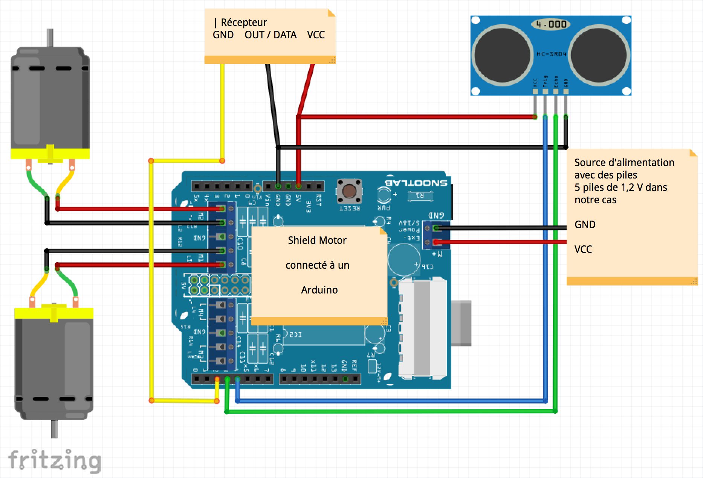

# Robot avec détection d’obstacles

Le but de ce projet est de réaliser un robot detecteur d'obstacles. Ici nous aurons a utiliser deux robots : 1 robot de tête et 1 robot de queue qui aura pour objectif de suivre le robot en tête.
Le robot de tête sera composer de 6 capteurs a ultrason et d'emetteur radio qui servira d'envoyer des données au robot de queue. Pour le robot en queue nous avons juste besoin d'un capteur a ultrason pour calculer la distance avec le robot en tête, et d'un recepteur à ultrason pour recevoir les données envoyer par le robot en tête.

### Composants et outils
- Une découpe Laser (utilisé pour faire le chassis des deux robots)
- Une imprimante 3D (utilisé pour imprimer certain accessoir comme le pare-choc et le socle à piles...).

[Cliquez ici pour avoir les plans des elements a imprimer](https://github.com/master1-ifi-semestre2/TER/tree/master/plans3D)

#### Pour le robot en tête:
- 1 Arduino (UNO)
- 1 Shield Motor
- 6 Ultrason sensor (HC-RC04)
- 1 Emetteur radio frequence (433MHz)
- 2 Moteurs
- 5 piles (1,2 V)

#### Pour le robot en queue:
- 1 Arduino (UNO)
- 1 Shield Motor
- 1 Ultrason sensor (HC-RC04)
- 1 Recepteur radio frequence (433MHz)
- 2 Moteurs
- 10 piles (1,2 V)

## Robot en queue (Scrappy Junior)
### Description
### Schema

Ici nous avons relié l'Arduino avec le schieldMotor.

### Connection Shield Motor avec Arduino

### Connection Shield Motor avec les moteurs

### Connection Shield Motor avec les capteurs Ultrason

### Connection Shield Motor avec l'Emeteur / Recepteur

### Utilisation de la découpe Laser

### Utilisation de l'imprimante 3D

## Description du code

[contact support](https://github.com/contact) and we’ll help you sort it out.
