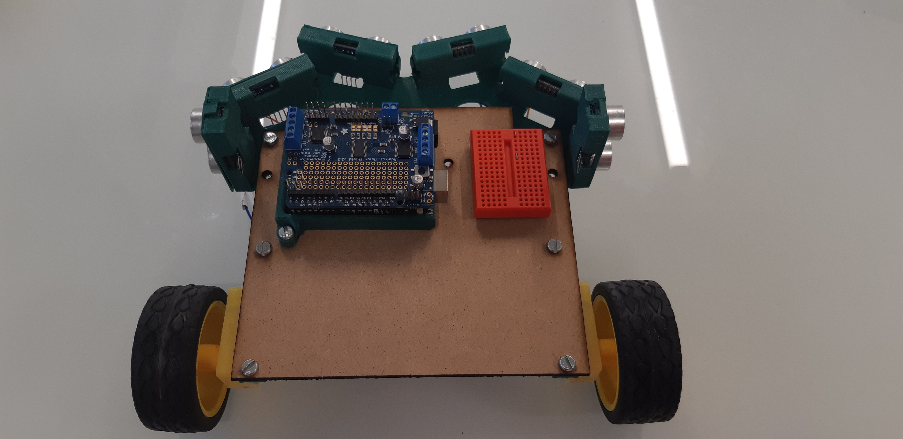

# Robot avec détection d’obstacles

Le but de ce tutoriel est de réaliser un robot detecteur d'obstacles. Ici nous aurons a utiliser deux robots : 1 robot de tête et 1 robot de queue qui aura pour objectif de suivre le robot en tête.

### Composants et outils
##### Robot de tête
Pour pouvoir construire le robot de tête, vous avez besoin de plusieurs éléments.
- 1 Arduino UNO (ou un autre type de microcontrôleur)
- 1 Shield Motor (Adafruit ou un autre type) pour contrêler les moteurs
- 2 Moteurs avec roues adaptées aux moteurs
- 1 roue libre
- 6 détecteurs de distance (ultrasonic sensor HC-RC04)
- 1 module emetteur sans fils 433Mhz (pour la communication radio fréquence)
- 1 boîtier pour 5 piles AA (de 1,2 V)
- des cables jumper
- 1 mini breadboard
- un chassi


##### Robot de queue
Pour construire le robot de queue, vous avez besoin de:
- 1 Arduino UNO
- 1 Shield Motor
- 2 Moteurs avec roues adaptées aux moteurs
- 1 roue libre
- 1 détecteurs de distance (ultrasonic sensor HC-RC04)
- 1 module récepteur sans fils 433Mhz (pour la communication radio fréquence)
- 1 boîtier pour 5 piles AA (de 1,2 V)
- des cables jumper
- 1 mini breadboard
- un chassi

#### Outils
- Une découpe Laser (utilisé pour faire le chassis des deux robots)
- Une imprimante 3D (utilisé pour imprimer certain accessoir comme le pare-choc et le boîtier à piles...).


## Assembler le robot
Après s'être procuré le matériel pour la conception du robot, on retourne le chassi pour exposer l'arrière ensuite monter les deux moteurs. Les deux moteurs doivent êtres monté symétriquement.
<p align="center">


</p>

Ensuite on monte les capteurs de distance à ultrason. Nous conseillons de renverser les capteus de gauche et de droite (pins vers le haut et pins vers le bas). Cela évitera aux capteurs de gauche de recevoir les ondes des capteurs de droite vis versa.

<p align="center">


</p>

Placer l'Arduino et la breadboard à l'emplacement comme le montre l'image en dessous. Attention ne pas oublier de relier Shield Motor avec l'Arduino, cela se fait facilement en placants les connecteurs du Shield Motor sur ceux de l'Arduino.



## Les branchements

Pour les branchements on commence par relier les câbles des moteurs aux connecteurs du Shield Motor connecté à l'Arduino comme le montre l'image en dessous (dans notre exemple nous avons utilisé M2 du Shield Motor pour le moteur à droite et M4 pour le motor à gauche, vous pouvez utiliser le numéro que vous voulez juste il faudra le modifier dans le code), et si les roues tournent à l'envers, il suffit juste d'inverser les câbles. Ensuite brancher les six capteurs toujours en suivant l'image en dessous, les GND (ground) entre les GND, les VCC (5v) entre les VCC...

<p align="center">


</p>


Dans l'image qui suit on peut voir l'Emetteur Radio Frequency 433Mhz. Son pin DATA est branché sur le pin A0 (ou pin 14) de l'Arduino (Arduino + Shield Motor).

<p align="center">


</p>

## L'alimentation
Pour alimenter le Robot en peut utiliser : le port USB, une prise secteur (avec le bon chageur qui va avec), ou des piles (batterie) AA.
Si vous optez pour une alimention via secteur ou USB vous devez les connecter à l'Arduino.

Si vous optez pour une alimentation avec les piles comme dans notre cas alors le branchement se fait sur le Shield Motor (on peut aussi le relier à l'Arduino) comme on peut le voir sur l'image du circuit (Les branchements) ci-dessus


## Installer le programme
On télécharge et installe l'IDE Arduino, l'IDE Arduino est l'environnement de développement de l'Arduino et il permet de programmer les instructions avant de les envoyer sur la plaque. On peut le télécharger gratuitement sur [arduino cc](https://www.arduino.cc/en/Main/Software).

## Programmer le robot
Pour programmer le robot il suffit de récuperer le code, l'ouvrir avec l'IDE Arduino, débrancher l'alimentation si vous utiliser des piles, et rélier l'Arduino à l'ordinateur...


## Description du code
```c
/****************************************************************************
   Sonar Robot

   Authors:  
      - BENSOUSSAN Chloé
      - BOUKOU Grâce
      - GRÉAU Alexandre      
      - WILHELM Andreina

   Permissions: MIT licence

*****************************************************************************/

#include <Wire.h>
#include <Adafruit_MotorShield.h>
#include <Adafruit_PWMServoDriver.h>
#include <TimerOne.h>
#include <VirtualWire.h>

#define FORWARD_ 0
#define BACKWARD_ 2
#define LEFT_ -1
#define RIGHT_ 1

/* Communication */
const int receive_pin = 17;               
const uint8_t myId = 1; // follower

typedef struct {
    int id;
    int value;
} Message;

Message msg;
byte msgSize = sizeof(msg);

/* Measurements */
const float safetyDistance = 27; // according with the speed, expressed in cm
const float robotWidth = 20; // and the height is 12 cm

/* Movement */
const int motorSpeed = 200;

// Create the motor shield object with the default I2C address
Adafruit_MotorShield AFMS = Adafruit_MotorShield();
// Or, create it with a different I2C address (say for stacking)
// Adafruit_MotorShield AFMS = Adafruit_MotorShield(0x61);

// Motor 1 -> right Motor 2 -> left
Adafruit_DCMotor *motorRight = AFMS.getMotor(1);
Adafruit_DCMotor *motorLeft = AFMS.getMotor(2);


/*
 * Moves the wheels
 */
void navigate() {
    int moveDir = msg.value;

    if(moveDir == FORWARD_) {// move forward
        Serial.println("avant  ");
        motorRight->run(FORWARD);
        motorLeft->run(FORWARD);
    } else if(moveDir == BACKWARD_) {// move backward
        Serial.println("arriere  ");
        motorRight->run(BACKWARD);
        motorLeft->run(BACKWARD);
    } else if(moveDir == LEFT_) {// move left
        Serial.println("gauche  ");
        motorRight->run(RELEASE);
        motorLeft->run(FORWARD);
    } else if(moveDir == RIGHT_) {// move right
        Serial.println("droite  ");
        motorRight->run(FORWARD);
        motorLeft->run(RELEASE);
    }
}


/*
 * Initial setup
 */
void setup() {
    // initialize serial communication:
    Serial.begin(9600);
    AFMS.begin();  // create with the default frequency 1.6KHz

    // Setup the receiver for communication
    vw_set_rx_pin(receive_pin);
    vw_setup(2000);
    vw_rx_start();

    // Set initial message
    msg.id = myId;
    msg.value = FORWARD_;

    // Right wheel
    // Set the speed to start, from 0 (off) to 255 (max speed)
    motorRight->setSpeed(motorSpeed);
    motorRight->run(FORWARD);

    // turn on motor
    motorRight->run(RELEASE);

    // Left wheel
    // Set the speed to start, from 0 (off) to 255 (max speed)
    motorLeft->setSpeed(motorSpeed);
    motorLeft->run(FORWARD);
    // turn on motor
    motorLeft->run(RELEASE);
}


/*
 * It executes navigate and sends the message
 */
void loop() {
    // check if a message has been received and stores it in the corresponding structure
    if (vw_get_message((byte *) &msg, &msgSize))// && formationMode) // Non-blocking
    {
        Serial.println("");
        Serial.print("Id: ");
        Serial.print(msg.id);
        Serial.print("  Value: ");
        Serial.println(msg.value);
    }

    navigate();
}
```


## Utilisation de la découpe Laser
Idéal pour pour découper le chassi


## Utilisation de l'imprimante 3D
Pour la conception des pieces formant le chassi du robot nous avons utilisé tinkercad pour modéliser nos pieces en 3D ensuite converti en gcode avec Cura.
L'imprimante 3D utilisé est un Ultimaker 3.

[Cliquez ici pour avoir les plans des elements a imprimer](https://github.com/master1-ifi-semestre2/TER/tree/master/plans3D)


